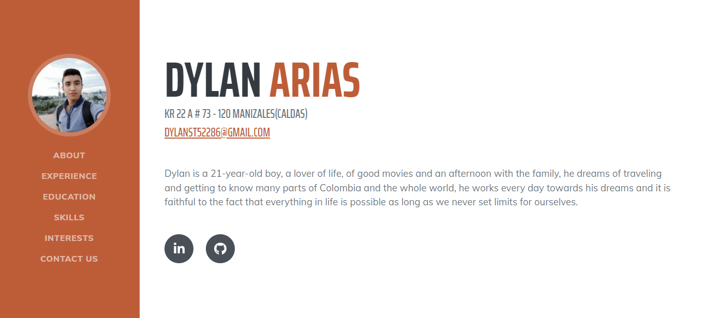
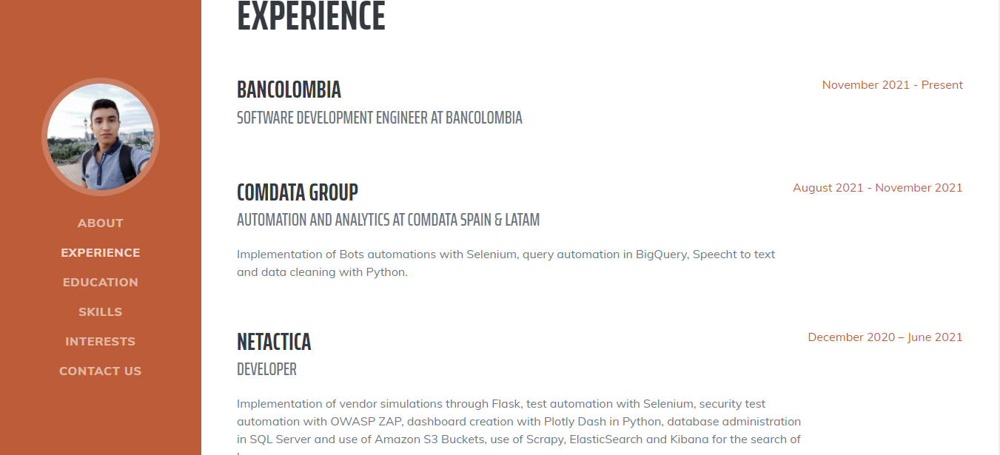
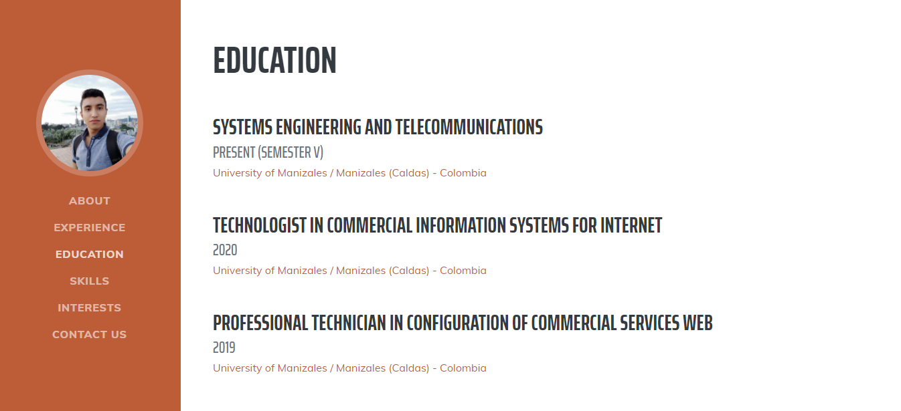
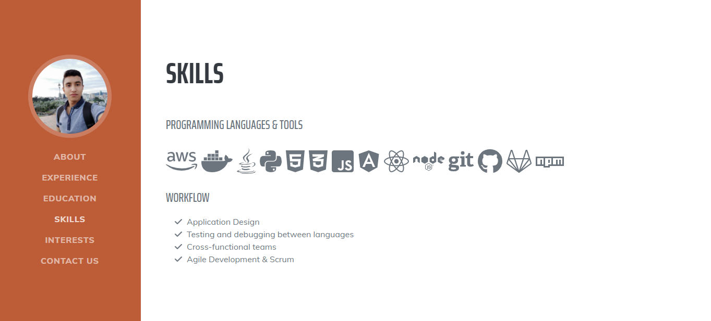
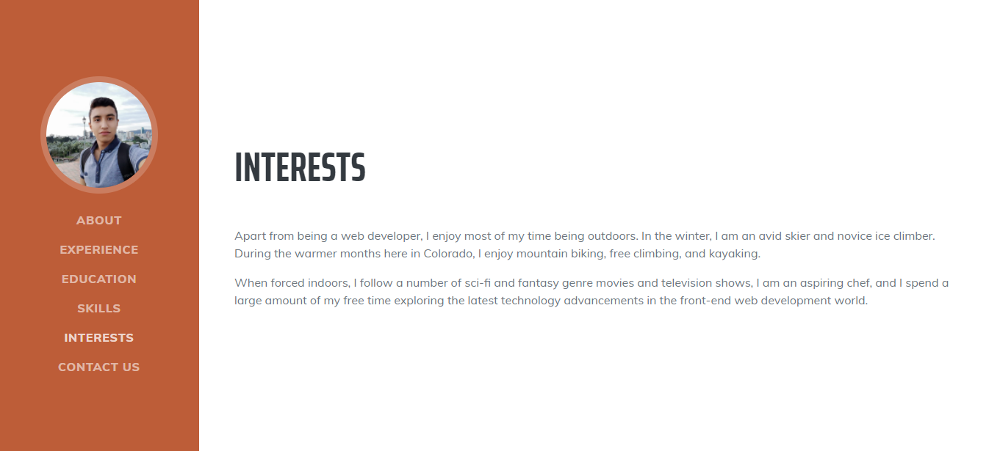
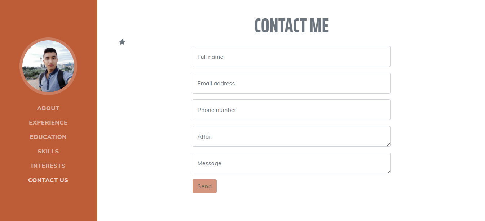

# CURRICULUM DYLAN ARIAS ARENAS

## Descripcion

Esta pagina es la hoja de vida de Dylan Arias Arenas, la cual cuenta con distintas secciones de 
About, Experience, Education, Skills, Interests, Contact Us

## Como clonar
> Para clonar el proyecto brindamos las siguientes 3 opciones.
 * **Clone with SSH:** 
 ```
 git@github.com:darias05/curriculum_vitae.git
 ```
 * **Clone with HTTPS:** 
 ```
 https://github.com/darias05/curriculum_vitae.git
 ```
  * **GitHub CLI:** 
 ```
 gh repo clone darias05/curriculum_vitae
 ```

## Autor
> Dylan Arias Arenas

# Vista previa

Este modulo nos ofrece la oportunidad de ver una vista previa de la construcción de la hoja de vida.

## ABOUT


## EXPERIENCE


## EDUCATION


## SKILLS


## INTERESTS


## CONTACT US


# Framework y plantillas

## Booststrap

Bootstrap es una biblioteca multiplataforma o conjunto de herramientas de código abierto para diseño de sitios y aplicaciones web.


Tomado de https://es.wikipedia.org/wiki/Bootstrap_(framework)

Hay un archivo principal llamado bootstrap.css, que contiene una definición para todos los estilos utilizados. Básicamente, la estructura del framework se compone de dos directorios:

+ ==css==: contiene los archivos necesarios para la estilización de los elementos y una alternativa al tema original
+ ==js==: contiene la parte posterior del archivo bootstrap.js (original y minificado), responsable de la ejecución de aplicaciones de estilo que requieren manipulación interactiva.

### Funcionalidades de Booststrap
+ ==Diseño Responsive==: Permite que la adaptacion de la pagina se realice según el tipo de dispositivo utilizado. Para garantizar la responsividad, el framework funciona con:
  - La estilizacion del elemento <div>
  - El uso de class container
+ ==Biblioteca de componentes==: Tiene componentes que pueden ser usados para proporcionar una mejor interacción y perfeccionar la comunicación con el usuario.
  - Alertas
  - Carrusel
  - Barras de navegacion

## Plantilla Booststrap

> Aca encontraras la URL de la plantilla de referencia para la construcción de nuestra pagina Web [Ir a la plantilla](https://startbootstrap.com/theme/resume)

## Available Scripts React

In the project directory, you can run:

### `npm start`

Runs the app in the development mode.\
Open [http://localhost:3000](http://localhost:3000) to view it in your browser.

The page will reload when you make changes.\
You may also see any lint errors in the console.

### `npm test`

Launches the test runner in the interactive watch mode.\
See the section about [running tests](https://facebook.github.io/create-react-app/docs/running-tests) for more information.

### `npm run build`

Builds the app for production to the `build` folder.\
It correctly bundles React in production mode and optimizes the build for the best performance.

The build is minified and the filenames include the hashes.\
Your app is ready to be deployed!

See the section about [deployment](https://facebook.github.io/create-react-app/docs/deployment) for more information.

### `npm run eject`

**Note: this is a one-way operation. Once you `eject`, you can't go back!**

If you aren't satisfied with the build tool and configuration choices, you can `eject` at any time. This command will remove the single build dependency from your project.

Instead, it will copy all the configuration files and the transitive dependencies (webpack, Babel, ESLint, etc) right into your project so you have full control over them. All of the commands except `eject` will still work, but they will point to the copied scripts so you can tweak them. At this point you're on your own.

You don't have to ever use `eject`. The curated feature set is suitable for small and middle deployments, and you shouldn't feel obligated to use this feature. However we understand that this tool wouldn't be useful if you couldn't customize it when you are ready for it.
